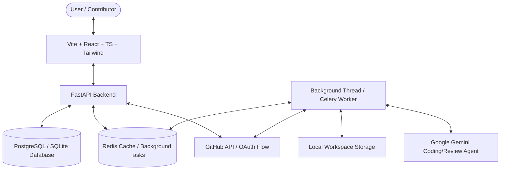

# Antigravity: Open Source AI Contribution Agent Platform

Antigravity is an end-to-end, production-ready AI-powered agentic platform designed to automate the open-source contribution workflow (discover eligible issues, request assignment, checkout workspaces, generate code fixes, run validation tests, perform code quality reviews, and generate draft pull requests) while keeping the human developer in full control.

---

## 🏗️ System Architecture

The platform comprises a FastAPI backend (SQLAlchemy ORM + background tasks dispatcher) and a Vite + React + TypeScript + TailwindCSS frontend designed with a premium, glowing dark-theme dashboard.



### Key Components
1. **GitHub OAuth Manager**: Handles OAuth sign-ins, session management, and encrypted storage of developer access tokens.
2. **Repository Analyzer**: Scans cloned codebases to automatically identify the programming language, build configuration, testing framework, and contribution guidelines.
3. **Issue Discovery & Ranking Engine**: Polls GitHub issues, filters out assigned/closed issues, and applies heuristic scoring (easy, medium, hard) to suggest high-suitability contributions.
4. **Workspace Git Manager**: Orchestrates git branch checkouts, resets, diff tracking, staging, committing, and remote pushes.
5. **Context Builder**: Combines issue metadata, codebase file structures, and relevant source file contents into highly optimized prompt payloads.
6. **Gemini Coding Agent**: Interacts with the `gemini-2.5-flash` model to return JSON-structured code modifications.
7. **Validation Runner**: Runs local compile, test, and lint commands, returning logs and outcome metrics.
8. **AI Review Agent**: Performs a separate code-quality check, validating the git diff for bugs, style, and security concerns.
9. **Human Approval Gateway**: Halts execution, presenting the final changes to the contributor for approval, rejection, or regeneration before submitting upstream PRs.

---

## 🛠️ Local Development Setup

### Backend (FastAPI)

1. **Prerequisites**: Python 3.11+, Git.
2. **Create Virtual Environment**:
   ```bash
   python -m venv venv
   # On Windows PowerShell:
   .\venv\Scripts\Activate.ps1
   # On Unix/macOS:
   source venv/bin/activate
   ```
3. **Install Dependencies**:
   ```bash
   pip install -r backend/requirements.txt
   ```
4. **Environment Configuration**:
   Copy the `.env` template in the workspace root and fill in details:
   ```env
   SECRET_KEY=supersecretjwtkey_change_me_in_production_1234567890
   DATABASE_URL=sqlite:///./agent_platform.db
   GEMINI_API_KEY=your_gemini_api_key
   # If GITHUB_CLIENT_ID is empty, the server automatically defaults to Developer Mock Login bypass
   GITHUB_CLIENT_ID=
   GITHUB_CLIENT_SECRET=
   ```
5. **Start FastAPI App**:
   ```bash
   cd backend
   python -m uvicorn app.main:app --reload --port 8000
   ```
   The API documentation will be interactive at `http://localhost:8000/docs`.

### Frontend (React + Vite)

1. **Prerequisites**: Node.js v18+.
2. **Install Node Packages**:
   ```bash
   cd frontend
   npm install
   ```
3. **Start Vite Development Server**:
   ```bash
   npm run dev
   ```
   Open `http://localhost:5173` in your browser. Use the **Developer Login** option to bypass OAuth Setup for testing.

---

## 🐳 Production Deployment

We provide a complete multi-container Docker deployment orchestrated via Docker Compose:

1. Build and run all services (Database, Redis, FastAPI, and serve static Nginx frontend assets):
   ```bash
   docker-compose up --build -d
   ```
2. The application will be serving at the root address `http://localhost`.

---

## 🔌 API Documentation

All APIs are prefixed with `/api/v1` and return JSON payloads.

### Authentication
* **GET `/auth/login`**: Redirects user to GitHub OAuth login. If client ID is not configured, redirects to mock login callback.
* **GET `/auth/callback`**: Handles code exchange and fetches user metadata.
  * *Mock query param*: `?mock_username=developer` (Forces developer login bypass).
* **GET `/auth/me`**: Returns the current authenticated user's profile.

### Repositories
* **POST `/repositories/register`**: Registers a repository fork URL.
  * *Payload*: `{"url": "https://github.com/user/repo"}`
  * *Response*: Triggers background workspace cloning and analyses.
* **GET `/repositories`**: Lists all connected repositories.
* **DELETE `/repositories/{repo_id}`**: Deletes repository metadata and cleans up local workspaces.

### Issues Discovery
* **GET `/issues`**: Lists open, unassigned issues ranked by suitability score.
  * *Filters*: `repository_id`, `difficulty`, `search`.
* **POST `/issues/scan/{repo_id}`**: Manually schedules a scan of issues for a repository.

### Assignments
* **POST `/assignments/request`**: Submits a request comment on the GitHub issue using the disclosure template.
  * *Payload*: `{"issue_id": "UUID"}`
* **GET `/assignments`**: Query assignment monitoring states.

### Agent Runs logs
* **GET `/runs`**: Lists all coding agent workflow executions.
* **GET `/runs/{run_id}`**: Returns logs list and active workflow statuses.
* **POST `/runs/trigger`**: Manually forces coding agent run.

### Pull Requests
* **GET `/prs`**: Lists generated PR templates.
* **POST `/prs/{pr_id}/approve`**: Approves the changes and submits a Pull Request to GitHub upstream.
* **POST `/prs/{pr_id}/reject`**: Rejects proposed changes and saves developer text feedback.

---

## 🔒 Security Architecture

1. **AES-256 Token Encryption**: GitHub OAuth access tokens are encrypted using `cryptography`'s Fernet symmetric encryption before storing in the database.
2. **JWT Session Management**: Communication uses JWT Bearer Tokens in headers.
3. **Workspace Isolation**: Git operations are fully isolated in separate workspace directories (`./workspaces/<repo_id>`) to prevent code collisions.
