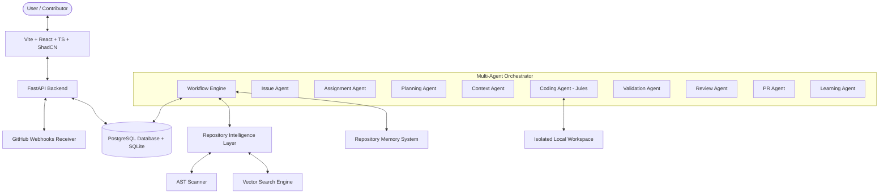

# Implementation Plan: AI-Powered Open Source Contribution Operating System (Phases 11-22)

This plan details the architecture, design patterns, database migrations, and API contracts required to upgrade the current platform from a GitHub workflow automator into an autonomous **AI-Powered Open Source Contribution Operating System (OS)**.

---

## 🏗️ Architecture & Core Extensions

We will expand the platform's modular services to implement active self-healing loops, multi-agent orchestration, repository semantic searching, long-term memory, and interactive review interfaces.

---

## 🗄️ Database Schema Migration (Phase 11-22 Tables)

We will define the following new tables in SQLAlchemy. These tables will be auto-generated on startup by `init_db`:

### 1. `repository_memory`
Stores long-term codebase memory, conventions, patterns, and past reviews.
- `id` (String, PK)
- `repository_id` (String, FK -> repositories.id)
- `key` (String, Indexed)
- `value` (Text)
- `memory_type` (String) - e.g. "pattern", "convention", "preference", "past_review", "past_failure", "past_fix"
- `created_at` (DateTime)
- `updated_at` (DateTime)

### 2. `repository_embeddings`
Stores code block chunk embeddings for local semantic search.
- `id` (String, PK)
- `repository_id` (String, FK -> repositories.id)
- `filepath` (String)
- `symbol` (String, Nullable)
- `content` (Text)
- `embedding` (JSON) - Cosine similarity calculated in Python/numpy.
- `created_at` (DateTime)

### 3. `agent_states`
Tracks LangGraph-style state data and current variables of active agents.
- `id` (String, PK)
- `run_id` (String, FK -> agent_runs.id)
- `agent_name` (String)
- `state_data` (JSON)
- `status` (String) - "idle", "busy", "error", "done"
- `updated_at` (DateTime)

### 4. `agent_tasks`
Detailed subtask tracking for multi-agent task execution timeline.
- `id` (String, PK)
- `run_id` (String, FK -> agent_runs.id)
- `task_name` (String)
- `description` (Text)
- `assignee` (String) - Agent executing it
- `status` (String) - "pending", "running", "completed", "failed"
- `result` (JSON, Nullable)
- `created_at` (DateTime)
- `updated_at` (DateTime)

### 5. `agent_plans`
Stores detailed implementation strategies created by the Planning Agent.
- `id` (String, PK)
- `run_id` (String, FK -> agent_runs.id)
- `title` (String)
- `description` (Text)
- `steps` (JSON) - Step list `[{"step": 1, "description": "...", "status": "pending"}]`
- `status` (String) - "pending_approval", "approved", "rejected"
- `feedback` (Text, Nullable)
- `created_at` (DateTime)
- `updated_at` (DateTime)

### 6. `agent_reviews`
Inspects git diffs, rating quality.
- `id` (String, PK)
- `pr_id` (String, FK -> pull_requests.id)
- `reviewer_name` (String)
- `report` (Text)
- `score` (Integer) - Code quality rating (0-100)
- `status` (String) - "passed", "failed_retry"
- `created_at` (DateTime)

### 7. `repair_attempts`
Logs details of the self-healing validation loop.
- `id` (String, PK)
- `run_id` (String, FK -> agent_runs.id)
- `attempt_number` (Integer)
- `error_message` (Text)
- `planned_fix` (Text)
- `result_logs` (Text)
- `status` (String) - "failed", "succeeded"
- `created_at` (DateTime)

### 8. `feedback_history`
Saves human developer actions for learning loops.
- `id` (String, PK)
- `repository_id` (String, FK -> repositories.id)
- `user_id` (String, FK -> users.id)
- `action` (String) - "approve", "reject", "regenerate"
- `feedback_text` (Text, Nullable)
- `code_diff` (Text, Nullable)
- `created_at` (DateTime)

### 9. `learning_signals`
Tracks maintainer preferences and standards derived from user reviews.
- `id` (String, PK)
- `repository_id` (String, FK -> repositories.id)
- `signal_type` (String) - "convention", "preference", "review_pattern"
- `description` (Text)
- `strength` (Float) - weight/strength metric (0.0 to 1.0)
- `created_at` (DateTime)

### 10. `webhook_events`
Logs received GitHub webhook deliveries.
- `id` (String, PK)
- `github_delivery_id` (String, Unique)
- `event_type` (String)
- `payload` (JSON)
- `status` (String) - "received", "processed", "failed"
- `error_message` (Text, Nullable)
- `created_at` (DateTime)

### 11. `code_search_index`
Stores AST parsed symbols mapping.
- `id` (String, PK)
- `repository_id` (String, FK -> repositories.id)
- `filepath` (String)
- `symbol_name` (String, Indexed)
- `symbol_type` (String) - e.g. "class", "function", "import"
- `start_line` (Integer)
- `end_line` (Integer)
- `content` (Text)
- `created_at` (DateTime)

### 12. `implementation_iterations`
Keeps track of coding iterations for diff reviews.
- `id` (String, PK)
- `run_id` (String, FK -> agent_runs.id)
- `iteration_number` (Integer)
- `explanation` (Text)
- `code_diff` (Text)
- `test_passed` (Boolean)
- `test_logs` (Text, Nullable)
- `created_at` (DateTime)

### 13. `quality_metrics`
Tracks scores for security, performance, style, and maintainability.
- `id` (String, PK)
- `run_id` (String, FK -> agent_runs.id)
- `security_score` (Integer)
- `performance_score` (Integer)
- `maintainability_score` (Integer)
- `style_score` (Integer)
- `overall_score` (Integer)
- `created_at` (DateTime)

---

## 🚀 Phase Implementation Plan

### Phase 11: Real Autonomous Coding Agent (Jules Integration)
* **Design**: Add `JulesCodingAgent` and provider implementations to `agent_provider.py` (Jules, Aider, OpenHands, Claude Code, Gemini, Local). Set Jules as default.
* **CLI Invocation**: Implement subprocess spawning to invoke tool CLI scripts where applicable, falling back to Gemini API parsing if CLI tools are not installed.
* **Dashboard**: Create **Agent Execution Viewer** in the frontend, visualizing active agent tasks, files being read/patched, and current step logs.

### Phase 12: Repository Intelligence Layer
* **AST Codebase Scanner**: Write an AST parser (using Python's `ast` package and high-fidelity regex/tokenizers for TS/JS/Go/Java) to index symbols, functions, imports, and dependencies.
* **Semantic Code Search**: Implement local embedding generation using Gemini API and store float vectors in `repository_embeddings`. Build a python/numpy cosine similarity query search.
* **Visualization**: Add a **Repository Intelligence** page to visualize codebase structure, symbols list, and import relationships.

### Phase 13: Multi-Agent Architecture
* **State Engine**: Design a custom workflow manager in Python (`agent_orchestrator.py`) supporting state persistence (`agent_states`), tracing, and failure recovery.
* **Agents**: Configure 9 specific agents (Issue, Assignment, Planning, Context, Coding, Validation, Review, PR, Learning).
* **Dashboard**: Build **Agent Monitor** showing active states, task queues, and execution timelines.

### Phase 14: Planning Agent
* **Orchestrator Halt**: Modify the main workflow runner to generate an implementation plan and pause execution (setting run state to `awaiting_plan_approval`).
* **Frontend Center**: Create a **Planning Center** page where the user can approve, reject, or request regeneration of the strategy plan before coding begins.

### Phase 15: Intelligent Code Search Agent
* **Context Gathering**: Connect codebase search index and semantic embeddings search into the Context Agent. Automatically retrieve target files, DTOs, and controllers based on issue keywords (e.g. "auth" -> AuthController).

### Phase 16: Self-Healing Implementation Loop
* **Repair Cycle**: Implement test failures analysis. If validation fails, parse compilation/test traceback logs, pass them back to the coding agent with a repair prompt, and repeat up to 3 times or until tests pass.
* **Dashboard**: Build **Self-Healing Viewer** showing repair attempts, files updated, and compiler log improvements.

### Phase 17: Active AI Review Loop
* **Review Loop**: After code generation and test validation, trigger the Review Agent. Evaluate code using custom prompts for style, performance, and security. Keep refactoring code until quality score >= 80.

### Phase 18: GitHub Webhook Architecture
* **Webhook Endpoint**: Create `/api/v1/webhooks/github` POST endpoint. Add HMAC-SHA256 signature verification validating payloads.
* **Celery Queue**: Queue webhook events (issue creation, comment, assignment) for asynchronous worker processing. Maintain polling fallback.

### Phase 19: ELUSOC Intelligence Layer
* **Tag Matching**: Detect issue eligibility using labels (`elusoc`, `good-first-issue`). Calculate contributor progress metrics.
* **Dashboard**: Add **ELUSOC Dashboard** highlighting eligible bounty issues, matching scores, and completed PR tracking.

### Phase 20: Repository Memory System
* **Long-Term Memory**: Create `MemoryEngine` storing code patterns, preferences, and reviews in `repository_memory`. Feed memory context back to the planning and coding agents.

### Phase 21: Human Feedback Learning System
* **Feedback loop**: Parse user PR feedback (approvals/rejections). Generate `learning_signals` to adjust planning weights.

### Phase 22: Advanced Draft PR Workspace
* **Review Workspace**: Create a full-screen GitHub-style PR workspace. Serve unified/side-by-side diff viewers, file browsers, test logs, and actions (Request Re-Implementation, Edit PR Title/Desc, Edit Commit Message).

---

## User Review Required

> [!IMPORTANT]
> - **ChromaDB / tree-sitter installation fallback**: To guarantee 100% build compatibility on the system (Python 3.13 on Windows), we will code high-fidelity Python fallbacks for AST parsing and semantic vector storage (using numpy/sqlite cosine similarity), ensuring that even if native binary wheels for ChromaDB or tree-sitter are missing on this Python version, the app still functions correctly.
> - **CLI Coding Agent execution**: Invoking real Jules/OpenHands CLI tools requires them to be installed on the host. We will invoke their respective command stubs, but implement full Gemini API logic as the underlying generator engine so you can run end-to-end tests even without having these CLIs preconfigured locally.

## Open Questions

> [!WARNING]
> 1. Do you have a configured **GitHub Webhook Secret** that we should set in the `.env` configuration, or should we define a default one (`supersecretwebhookkey`) for webhook testing?
> 2. Should we prioritize **ChromaDB**/native database binaries first, or implement the SQLite-numpy vector search engine as the primary robust default for local execution?
