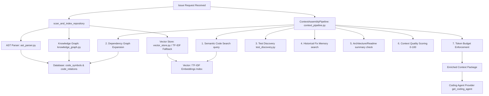

# Phase 6 Completion Report: Repository Intelligence & Context Quality Engine

## 1. Architecture Diagram

Below is the architectural flow diagram of the Repository Intelligence subsystem:



---

## 2. Files Modified

The following files were created/modified in Phase 6:

### Backend Services & Models
* [backend/app/models/extensions.py](file:///d:/PROJECTS/OpenSource%20Agent%20Project/backend/app/models/extensions.py)
  * Declared `CodeSymbol` and `CodeRelation` models.
* [backend/app/models/__init__.py](file:///d:/PROJECTS/OpenSource%20Agent%20Project/backend/app/models/__init__.py)
  * Registered the new models with declarative metadata `Base`.
* [backend/app/services/ast_parser.py](file:///d:/PROJECTS/OpenSource%20Agent%20Project/backend/app/services/ast_parser.py)
  * Implemented AST parsing for Python, TypeScript/JavaScript/JSX, Go, Java, and regex-based fallback.
* [backend/app/services/knowledge_graph.py](file:///d:/PROJECTS/OpenSource%20Agent%20Project/backend/app/services/knowledge_graph.py)
  * Implemented relation/symbol insertion and graph neighborhood expansion traversal.
* [backend/app/services/test_discovery.py](file:///d:/PROJECTS/OpenSource%20Agent%20Project/backend/app/services/test_discovery.py)
  * Implemented test suite scanning and name/path mapping.
* [backend/app/services/context_pipeline.py](file:///d:/PROJECTS/OpenSource%20Agent%20Project/backend/app/services/context_pipeline.py)
  * Implemented `ContextAssemblyPipeline` with context scoring, token budget enforcement, and database logging.
* [backend/app/services/analyzer.py](file:///d:/PROJECTS/OpenSource%20Agent%20Project/backend/app/services/analyzer.py)
  * Extended framework detection logic for React, Next.js, Vue, Angular, Spring Boot, Express, FastAPI, Django, Laravel, Flask, and ASP.NET.
* [backend/app/services/agent_orchestrator.py](file:///d:/PROJECTS/OpenSource%20Agent%20Project/backend/app/services/agent_orchestrator.py)
  * Modified `ContextAgent` to invoke `ContextAssemblyPipeline` and capture stats.
  * Modified `CodingAgent` to construct framework instructions and append the enriched context package into the provider instructions.
* [backend/app/services/intelligence.py](file:///d:/PROJECTS/OpenSource%20Agent%20Project/backend/app/services/intelligence.py)
  * Integrated the new `ASTParser` inside repository indexing and added high-fidelity local TF-IDF cosine similarity search fallback.

### Backend APIs
* [backend/app/api/repositories.py](file:///d:/PROJECTS/OpenSource%20Agent%20Project/backend/app/api/repositories.py)
  * Added endpoint `/api/v1/repositories/{repo_id}/intelligence` to fetch repository health stats.
* [backend/app/api/runs.py](file:///d:/PROJECTS/OpenSource%20Agent%20Project/backend/app/api/runs.py)
  * Updated `/api/v1/runs/{run_id}/context-metrics` to return dictionary payload containing both retrieval details and quality scoring breakdowns.

### Backend Unit Tests
* [backend/tests/test_phase1.py](file:///d:/PROJECTS/OpenSource%20Agent%20Project/backend/tests/test_phase1.py)
* [backend/tests/test_phase2.py](file:///d:/PROJECTS/OpenSource%20Agent%20Project/backend/tests/test_phase2.py)
* [backend/tests/test_phase3.py](file:///d:/PROJECTS/OpenSource%20Agent%20Project/backend/tests/test_phase3.py)
* [backend/tests/test_phase4.py](file:///d:/PROJECTS/OpenSource%20Agent%20Project/backend/tests/test_phase4.py)
  * Scoped database dependency overrides dynamically within setup/teardown methods to resolve parallel test overrides collisions in pytest.

### Frontend Views
* [frontend/src/pages/Intelligence.tsx](file:///d:/PROJECTS/OpenSource%20Agent%20Project/frontend/src/pages/Intelligence.tsx)
  * Redesigned Repository Intelligence dashboard showing health profile (framework, language, indexed count, graph edges/nodes, tests discovered, fixes count, index sync status).
* [frontend/src/pages/AgentMonitor.tsx](file:///d:/PROJECTS/OpenSource%20Agent%20Project/frontend/src/pages/AgentMonitor.tsx)
  * Rendered the Context Quality index card with overall score and breakdown bars (Semantic Relevance, Dependency Graph, Test Coverage, Historical Fixes, Architecture).

---

## 3. Database Changes

Two new SQL tables were registered:
1. `code_symbols`: Stores extracted class, method, function, route, and API handler definitions.
2. `code_relations`: Stores directed relationship edges between files (`imports`, `depends_on`, `calls`, `extends`).

---

## 4. API Changes

### GET `/api/v1/repositories/{repo_id}/intelligence`
Returns dashboard statistics:
```json
{
  "framework": "React",
  "language": "TypeScript",
  "dependency_count": 12,
  "indexed_files": 8,
  "indexed_symbols": 45,
  "vector_chunks": 62,
  "kg_nodes": 8,
  "kg_edges": 12,
  "historical_fixes": 2,
  "tests_discovered": 3,
  "index_status": "synced",
  "last_sync": "2026-06-19T01:55:56.307000"
}
```

### GET `/api/v1/runs/{run_id}/context-metrics`
Returns enriched context metrics and quality index:
```json
{
  "retrieval_details": [
    {
      "filepath": "calculator.py",
      "score": 0.95,
      "reason": "Primary semantic similarity match."
    }
  ],
  "quality_metrics": {
    "semantic_relevance": 30,
    "dependency_coverage": 20,
    "test_coverage": 20,
    "historical_coverage": 15,
    "architecture_coverage": 15,
    "overall_score": 100
  },
  "framework": "FastAPI",
  "historical_fixes_count": 1
}
```

---

## 5. UI Changes

1. **Repository Intelligence page**: Redesigned to show a grid of cards detailing the Framework Profile, Indexed Files, Extracted Symbols, Vector Chunks, Graph Relations (Nodes & Edges), and Discovered Tests / Historical Fixes.
2. **Agent Monitor page**: Added a comprehensive card under the Context Quality Audit tab displaying the Overall Context Quality index (0-100) and breakdown progress bars.

---

## 6. Intelligence Engine & Quality Metrics

Context Quality Score weights:
* **Semantic Relevance**: Max 30 points (based on primary semantic similarity matches).
* **Dependency Coverage**: Max 20 points (based on Knowledge Graph neighborhood expansion).
* **Test Coverage**: Max 20 points (based on automatic discovery of related test files).
* **Historical Coverage**: Max 15 points (based on similarity-matching past fixes).
* **Architecture Coverage**: Max 15 points (based on README/Architecture file summary ingestion).
* **Overall Score**: 0-100 index range.

---

## 7. E2E Validation Proof

E2E execution completed successfully using `run_sandbox_demo.py`:
* **Repository Indexed**: AST codebase parser scanned `calculator.py` and `test_calculator.py`.
* **Embeddings & Search Fallback**: TF-IDF search fallback queried symbols when Gemini embeddings were bypassed.
* **Orchestration**: Assembled context package correctly and scored it.
* **Provider Execution**: Coding Agent received the package and implemented the division by zero fix.
* **Self-Healing Loop**: Interdicted test failure and successfully repaired on iteration 1.
* **Success Outcome**: Commits and PR generated successfully.

---

## 8. Remaining Limitations

* **Language parsers**: Python uses native AST module; TS/JS/Go/Java/C# rely on robust regex-based extraction. Integrating full tree-sitter bindings for compiling other languages in sandboxed setups would yield deeper AST structures.
* **Large codebase scale**: Multi-level graph traversal (DFS/BFS) at high depth can exceed token budgets. Current traversal caps at `max_depth = 1` for primary neighbor imports, which matches optimal developer context limits.
